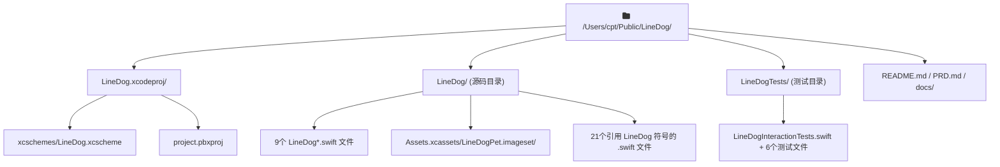

# LineDog → MalDaze 完整重命名计划

## 影响范围概览

---

## 第一步：文件内容替换（先于重命名）

对以下所有文件，按顺序执行字符串替换（顺序很关键，防止重复替换）：

### 替换规则（按优先级排序）

| 原字符串 | 新字符串 | 说明 |
|---|---|---|
| `com.linedog.LineDogTests` | `com.maldaze.MalDazeTests` | Bundle ID（测试 target，先处理避免误匹配） |
| `com.linedog.LineDog` | `com.maldaze.MalDaze` | Bundle ID（主 target） |
| `com.linedog.` | `com.maldaze.` | 通知名称、Window ID 中的剩余 |
| `LINEDOG_` | `MALDAZE_` | 环境变量名 |
| `LineDogTests` | `MalDazeTests` | 先于 LineDog 处理 |
| `LineDog` | `MalDaze` | 类型名、字符串、注释等 |
| `linedog` | `maldaze` | 余留小写（如有） |
| `/Public/LineDog/` | `/Public/MalDaze/` | 硬编码路径（仅1处） |

### 涉及的具体文件及每个文件的变更内容

#### Xcode 项目文件

**[`LineDog.xcodeproj/project.pbxproj`](LineDog.xcodeproj/project.pbxproj)**
- 文件引用注释：`LineDogApp.swift` → `MalDazeApp.swift`（及其他9个 `LineDog*.swift` 文件）
- PBXGroup 注释：`E201 /* LineDog */` → `MalDaze`，`E206 /* LineDogTests */` → `MalDazeTests`
- 产品引用：`C200 /* LineDog.app */` → `MalDaze.app`，`C301 /* LineDogTests.xctest */` → `MalDazeTests.xctest`
- 源码组路径：`path = LineDog;` → `path = MalDaze;`，`path = LineDogTests;` → `path = MalDazeTests;`
- 目标名：`name = LineDog;` → `MalDaze`，`name = LineDogTests;` → `MalDazeTests`
- 目标产品名：`productName = LineDog;` / `productName = LineDogTests;`
- 构建配置列表注释：`"PBXNativeTarget \"LineDog\""` → `MalDaze`，测试同理
- 项目注释：`"PBXProject \"LineDog\""` → `MalDaze`
- `remoteInfo = LineDog;` → `MalDaze`
- `INFOPLIST_KEY_CFBundleDisplayName = "LineDog Rest";` → `"MalDaze Rest"`（Debug+Release 各1处）
- `INFOPLIST_KEY_NSRemindersUsageDescription` 中的 `LineDog` → `MalDaze`（2处）
- `PRODUCT_BUNDLE_IDENTIFIER = com.linedog.LineDog;` → `com.maldaze.MalDaze`（2处）
- `PRODUCT_BUNDLE_IDENTIFIER = com.linedog.LineDogTests;` → `com.maldaze.MalDazeTests`（2处）
- `TEST_HOST = "$(BUILT_PRODUCTS_DIR)/LineDog.app/Contents/MacOS/LineDog";` → `MalDaze`（2处）

**[`LineDog.xcodeproj/xcshareddata/xcschemes/LineDog.xcscheme`](LineDog.xcodeproj/xcshareddata/xcschemes/LineDog.xcscheme)**（此文件之后将被重命名）
- `BuildableName = "LineDog.app"` → `"MalDaze.app"`（3处）
- `BlueprintName = "LineDog"` → `"MalDaze"`（3处）
- `BuildableName = "LineDogTests.xctest"` → `"MalDazeTests.xctest"`（1处）
- `BlueprintName = "LineDogTests"` → `"MalDazeTests"`（1处）
- `ReferencedContainer = "container:LineDog.xcodeproj"` → `"container:MalDaze.xcodeproj"`（4处）

**[`LineDog.xcodeproj/xcuserdata/cpt.xcuserdatad/xcschemes/xcschememanagement.plist`](LineDog.xcodeproj/xcuserdata/cpt.xcuserdatad/xcschemes/xcschememanagement.plist)**
- `LineDogTests.xcscheme` → `MalDazeTests.xcscheme`

#### 主 Target Swift 文件（文件名将在第二步重命名）

**[`LineDog/LineDogApp.swift`](LineDog/LineDogApp.swift)** → 重命名为 `MalDazeApp.swift`
- `struct LineDogApp` → `struct MalDazeApp`
- `LineDogAppDelegate` → `MalDazeAppDelegate`
- `LineDogSettingsView` → `MalDazeSettingsView`

**[`LineDog/LineDogAppDelegate.swift`](LineDog/LineDogAppDelegate.swift)** → 重命名为 `MalDazeAppDelegate.swift`
- `class LineDogAppDelegate` → `class MalDazeAppDelegate`
- `globalLineDogKeyMonitor` → `globalMalDazeKeyMonitor`
- `LineDogDefaults` → `MalDazeDefaults`（2处）
- `LineDogDockIcon` → `MalDazeDockIcon`（1处）
- `LineDogCarbonGlobalHotKeys` → `MalDazeCarbonGlobalHotKeys`（2处）
- `LineDogBroadcastNotifications` → `MalDazeBroadcastNotifications`（1处）
- 注释中的 `LineDogPet` → `MalDazePet`

**[`LineDog/LineDogBroadcastNotifications.swift`](LineDog/LineDogBroadcastNotifications.swift)** → 重命名为 `MalDazeBroadcastNotifications.swift`
- `enum LineDogBroadcastNotifications` → `enum MalDazeBroadcastNotifications`
- 所有 `"com.linedog.*"` → `"com.maldaze.*"`（5处 Notification.Name）

**[`LineDog/LineDogCarbonGlobalHotKeys.swift`](LineDog/LineDogCarbonGlobalHotKeys.swift)** → 重命名为 `MalDazeCarbonGlobalHotKeys.swift`
- 所有 `LineDog` 类型名/引用 → `MalDaze`

**[`LineDog/LineDogDefaults.swift`](LineDog/LineDogDefaults.swift)** → 重命名为 `MalDazeDefaults.swift`
- `enum LineDogDefaults` → `enum MalDazeDefaults`
- 所有 UserDefaults 键字符串 `"LineDog.*"` → `"MalDaze.*"`（~13处）

**[`LineDog/LineDogDockIcon.swift`](LineDog/LineDogDockIcon.swift)** → 重命名为 `MalDazeDockIcon.swift`
- 所有 `LineDog` 类型名 → `MalDaze`

**[`LineDog/LineDogPresentationAnchor.swift`](LineDog/LineDogPresentationAnchor.swift)** → 重命名为 `MalDazePresentationAnchor.swift`
- `enum LineDogAgentDebugNDJSON` → `enum MalDazeAgentDebugNDJSON`
- 硬编码路径：`"/Users/cpt/Public/LineDog/.cursor/debug-00efd9.log"` → `"/Users/cpt/Public/MalDaze/.cursor/debug-00efd9.log"`
- `enum LineDogPresentationAnchor` → `enum MalDazePresentationAnchor`
- `func preferredScreenForLineDogAuxiliaryUI()` → `preferredScreenForMalDazeAuxiliaryUI()`
- `class LineDogEphemeralKeyWindow` → `class MalDazeEphemeralKeyWindow`
- `enum LineDogModalKeyWindowAnchor` → `enum MalDazeModalKeyWindowAnchor`
- location 字符串中的 `"LineDogPresentationAnchor.swift"` → `"MalDazePresentationAnchor.swift"`

**[`LineDog/Settings/LineDogSettingsView.swift`](LineDog/Settings/LineDogSettingsView.swift)** → 重命名为 `MalDazeSettingsView.swift`
- `struct LineDogSettingsView` → `struct MalDazeSettingsView`
- 所有 `LineDogDefaults.*` → `MalDazeDefaults.*`（~12处）
- 所有 `LineDogGeminiModelCatalog.*` → `MalDazeGeminiModelCatalog.*`（2处）
- 用户可见文本 `"LineDog"` → `"MalDaze"`（1处）
- `enum LineDogSettingsWindowPresenter` → `enum MalDazeSettingsWindowPresenter`
- `w.title = "LineDog 设置"` → `"MalDaze 设置"`
- `NSHostingController(rootView: LineDogSettingsView())` → `MalDazeSettingsView()`
- `LineDogPresentationAnchor.*` → `MalDazePresentationAnchor.*`（2处）

**[`LineDog/SmartReminder/LineDogGeminiModelCatalog.swift`](LineDog/SmartReminder/LineDogGeminiModelCatalog.swift)** → 重命名为 `MalDazeGeminiModelCatalog.swift`
- `LineDogGeminiModelCatalog` → `MalDazeGeminiModelCatalog`
- `LineDogDefaults` → `MalDazeDefaults`

#### 其他 Swift 源文件（只有内容变更，文件名不变）

**[`LineDog/AppViewModel.swift`](LineDog/AppViewModel.swift)**
- `LineDogDefaults.*` → `MalDazeDefaults.*`（7处）
- `LineDogSettingsWindowPresenter` → `MalDazeSettingsWindowPresenter`（2处）
- `"LineDog Rest"` → `"MalDaze Rest"`（UI文本，1处）
- `LineDogRoutineTag.*` → `MalDazeRoutineTag.*`（1处）
- `LineDogBroadcastNotifications.*` → `MalDazeBroadcastNotifications.*`（4处）
- `"LineDog.restBlocksClicksDuringRest"` → `"MalDaze.restBlocksClicksDuringRest"`
- `LineDogDefaults.geminiAPIKey` → `MalDazeDefaults.geminiAPIKey`

**[`LineDog/WindowManager/WindowManager.swift`](LineDog/WindowManager/WindowManager.swift)**
- `"com.linedog.deskPetStage"` → `"com.maldaze.deskPetStage"`
- `"LineDog requires..."` → `"MalDaze requires..."`
- `"LineDog.idlePetOriginX"` / `"LineDog.idlePetOriginY"` → `"MalDaze.*"`
- `LineDogPresentationAnchor.*` → `MalDazePresentationAnchor.*`
- `LineDogBroadcastNotifications.*` → `MalDazeBroadcastNotifications.*`

**[`LineDog/PetRenderer/PetRenderer.swift`](LineDog/PetRenderer/PetRenderer.swift)**
- `NSImage(named: "LineDogPet")` → `NSImage(named: "MalDazePet")`

**[`LineDog/SmartReminder/SmartReminderModelDebugLog.swift`](LineDog/SmartReminder/SmartReminderModelDebugLog.swift)**
- 环境变量：`"LINEDOG_SMART_REMINDER_LOG_PATH"` → `"MALDAZE_SMART_REMINDER_LOG_PATH"`
- Application Support 路径：`"LineDog"` → `"MalDaze"`
- xcodeproj 名称检查：`"LineDog.xcodeproj"` → `"MalDaze.xcodeproj"`

**[`LineDog/Reminders/DeskRemindersModel.swift`](LineDog/Reminders/DeskRemindersModel.swift)**
- `LineDogAgentDebugNDJSON.*` → `MalDazeAgentDebugNDJSON.*`
- `LineDogModalKeyWindowAnchor.*` → `MalDazeModalKeyWindowAnchor.*`

**[`LineDog/Reminders/EventKitRemindersBacking.swift`](LineDog/Reminders/EventKitRemindersBacking.swift)**
- `enum LineDogReminderEventStore` → `enum MalDazeReminderEventStore`
- `LineDogAgentDebugNDJSON.*` → `MalDazeAgentDebugNDJSON.*`
- `LineDogRoutineTag.*` → `MalDazeRoutineTag.*`

**[`LineDog/Reminders/RemindersSelectedListPreference.swift`](LineDog/Reminders/RemindersSelectedListPreference.swift)**
- `"LineDog.remindersSelectedCalendarIdentifier"` → `"MalDaze.remindersSelectedCalendarIdentifier"`

**[`LineDog/SmartReminder/SmartReminderNotesComposer.swift`](LineDog/SmartReminder/SmartReminderNotesComposer.swift)**
- `enum LineDogRoutineTag` → `enum MalDazeRoutineTag`
- `LineDogRoutineTag.*` → `MalDazeRoutineTag.*`

**[`LineDog/SmartReminder/GeminiRemindersAPIClient.swift`](LineDog/SmartReminder/GeminiRemindersAPIClient.swift)**
- `LineDogGeminiModelCatalog.*` → `MalDazeGeminiModelCatalog.*`

**[`LineDog/SmartReminder/EventKitReminderMutationService.swift`](LineDog/SmartReminder/EventKitReminderMutationService.swift)**
- `LineDogReminderEventStore.*` → `MalDazeReminderEventStore.*`

**[`LineDog/FiveMinuteCat/FiveMinuteCatCompanionController.swift`](LineDog/FiveMinuteCat/FiveMinuteCatCompanionController.swift)**
- `LineDogAgentDebugNDJSON.*` → `MalDazeAgentDebugNDJSON.*`
- `LineDogModalKeyWindowAnchor.*` → `MalDazeModalKeyWindowAnchor.*`

**[`LineDog/WindowManager/PetStageView.swift`](LineDog/WindowManager/PetStageView.swift)**
- `LineDogAgentDebugNDJSON.*` → `MalDazeAgentDebugNDJSON.*`

**快捷键文件**（[`DeskPetMenuShortcut.swift`](LineDog/DeskPetMenuShortcut.swift)、[`ResetIdlePetPositionShortcut.swift`](LineDog/ResetIdlePetPositionShortcut.swift)、[`SevenMinuteReminderShortcut.swift`](LineDog/SevenMinuteReminderShortcut.swift)、[`SmartReminderInputShortcut.swift`](LineDog/SmartReminderInputShortcut.swift)、[`SevenMinuteReminderShortcut.swift`](LineDog/SevenMinuteReminderShortcut.swift)）
- 所有 `LineDogDefaults.*` → `MalDazeDefaults.*`

**[`LineDog/SevenMinuteReminder/SevenMinuteReminderController.swift`](LineDog/SevenMinuteReminder/SevenMinuteReminderController.swift)**
- `LineDogDefaults.*` → `MalDazeDefaults.*`

#### 测试文件

**[`LineDogTests/LineDogInteractionTests.swift`](LineDogTests/LineDogInteractionTests.swift)** → 重命名为 `MalDazeInteractionTests.swift`
- `@testable import LineDog` → `@testable import MalDaze`
- `class LineDogInteractionTests` → `class MalDazeInteractionTests`

**其余6个测试文件**（[`DeskReminderSidebarMergerTests.swift`](LineDogTests/DeskReminderSidebarMergerTests.swift)、[`DeskReminderTimeFormatterTests.swift`](LineDogTests/DeskReminderTimeFormatterTests.swift)、[`MockRemindersEventStoreBacking.swift`](LineDogTests/MockRemindersEventStoreBacking.swift)、[`MockWindowManager.swift`](LineDogTests/MockWindowManager.swift)、[`RemindersSyncCoordinatorTests.swift`](LineDogTests/RemindersSyncCoordinatorTests.swift)、[`SmartReminderNotesComposerTests.swift`](LineDogTests/SmartReminderNotesComposerTests.swift)、[`SmartReminderOrchestratorTests.swift`](LineDogTests/SmartReminderOrchestratorTests.swift)）
- 所有 `@testable import LineDog` → `@testable import MalDaze`
- `SmartReminderOrchestratorTests.swift` 额外：`"LineDog.tests.geminiModel"` → `"MalDaze.tests.geminiModel"`，`LineDogGeminiModelCatalog.*` → `MalDazeGeminiModelCatalog.*`，`LineDogDefaults.*` → `MalDazeDefaults.*`

#### 文档文件

**[`README.md`](README.md)**
- 所有 `LineDog` → `MalDaze`（标题、xcodeproj 名、Scheme 名、Bundle ID、UI文本等）

**[`PRD.md`](PRD.md)**
- 所有 `LineDog` → `MalDaze`

**[`docs/LAYOUT_AUDIT.md`](docs/LAYOUT_AUDIT.md)**
- 所有 `LineDog` → `MalDaze`

#### Asset Catalog

**`LineDog/Assets.xcassets/LineDogPet.imageset/Contents.json`**（目录将在第二步重命名）
- Contents.json 本身无文字需改（imageset 元数据）

**`LineDog/Assets.xcassets/AppIcon.appiconset/LineDogMark.png`**
- 仅需重命名文件（PNG 二进制内容不变）

**`LineDog/Assets.xcassets/LineDogPet.imageset/LineDogMark.png`**
- 仅需重命名文件（PNG 二进制内容不变）

---

## 第二步：文件重命名

| 原路径 | 新路径 |
|---|---|
| `LineDog/LineDogApp.swift` | `LineDog/MalDazeApp.swift` |
| `LineDog/LineDogAppDelegate.swift` | `LineDog/MalDazeAppDelegate.swift` |
| `LineDog/LineDogBroadcastNotifications.swift` | `LineDog/MalDazeBroadcastNotifications.swift` |
| `LineDog/LineDogCarbonGlobalHotKeys.swift` | `LineDog/MalDazeCarbonGlobalHotKeys.swift` |
| `LineDog/LineDogDefaults.swift` | `LineDog/MalDazeDefaults.swift` |
| `LineDog/LineDogDockIcon.swift` | `LineDog/MalDazeDockIcon.swift` |
| `LineDog/LineDogPresentationAnchor.swift` | `LineDog/MalDazePresentationAnchor.swift` |
| `LineDog/Settings/LineDogSettingsView.swift` | `LineDog/Settings/MalDazeSettingsView.swift` |
| `LineDog/SmartReminder/LineDogGeminiModelCatalog.swift` | `LineDog/SmartReminder/MalDazeGeminiModelCatalog.swift` |
| `LineDogTests/LineDogInteractionTests.swift` | `LineDogTests/MalDazeInteractionTests.swift` |
| `LineDog/Assets.xcassets/AppIcon.appiconset/LineDogMark.png` | `AppIcon.appiconset/MalDazeMark.png` |
| `LineDog/Assets.xcassets/LineDogPet.imageset/LineDogMark.png` | `LineDogPet.imageset/MalDazeMark.png` |
| `LineDog.xcodeproj/xcshareddata/xcschemes/LineDog.xcscheme` | `…/xcschemes/MalDaze.xcscheme` |

---

## 第三步：目录重命名

| 原目录 | 新目录 |
|---|---|
| `LineDog/Assets.xcassets/LineDogPet.imageset/` | `MalDazePet.imageset/` |
| `LineDog/` (源码根目录) | `MalDaze/` |
| `LineDogTests/` | `MalDazeTests/` |
| `LineDog.xcodeproj/` | `MalDaze.xcodeproj/` |

> 注意：project.pbxproj 中两处 `path = LineDog;` 和 `path = LineDogTests;` 已在第一步替换为 `MalDaze` / `MalDazeTests`，与上述目录重命名一致。

---

## 第四步：项目根目录重命名（最后手动确认）

`/Users/cpt/Public/LineDog/` → `/Users/cpt/Public/MalDaze/`

此步需要在 Xcode 完全关闭后执行，并在重命名后重新在 Xcode 打开 `MalDaze.xcodeproj`。`LineDogPresentationAnchor.swift` 中的调试日志路径会在第一步同步更新为 `/Users/cpt/Public/MalDaze/.cursor/debug-00efd9.log`。

---

## 重要说明

- **Bundle ID** 从 `com.linedog.LineDog` 改为 `com.maldaze.MalDaze`：系统「提醒事项」授权会重置，需重新授权一次。
- **UserDefaults 键**从 `"LineDog.*"` 改为 `"MalDaze.*"`：已存储的用户设置（快捷键、API Key 等）在新版本首次启动时会恢复默认值，需重新配置。
- **DerivedData** 在重命名后需清理（Product → Clean Build Folder）。
