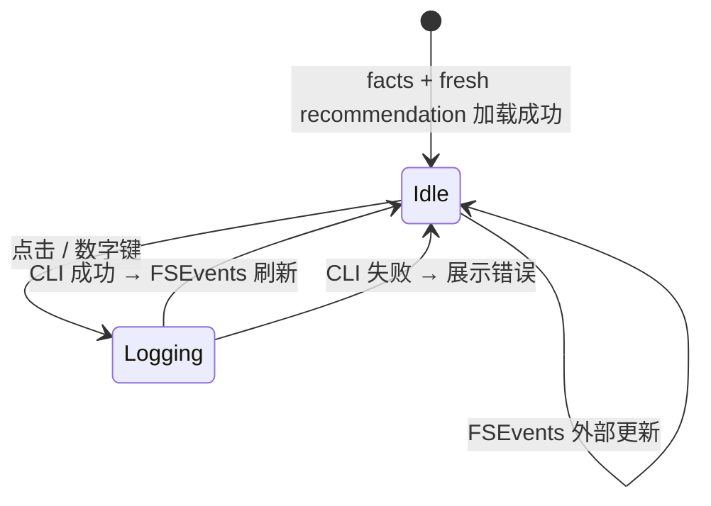

# Design · 饮食建议「一键记录」交互（点击 + 数字键）

> 父文档：[design-maldaze.md](./design-maldaze.md) · Spec：`nutrition-today-panel` · 用户追加 **S7 / S7-K**<br>
> Superseded alignment: 可记录建议项来自 fresh `recommendation.json`，不是 `daily_log.panel.suggestions`。

## 1. 用户目标

在桌宠 Dashboard 饮食区，用 **最少步数** 把 Hermes-authored fresh 推荐里的某一格 `loggable` 食物记为已吃，等同飞书侧 `recommend.py log "<name>" <grams>`，且 **不** 打开确认框、不手改 JSON。

两条入口 **等价**：

| 入口 | 动作 |
|------|------|
| **点击** | 点某建议食物行 |
| **数字键** | 按主键盘 `1`–`9`（无修饰键） |

---

## 2. 数据与索引（Flatten Index）

### 2.1 可记录对象

仅 fresh **`recommendation.json.suggestions[].items[]`** 中 `loggable: true` 的项。每条可记录 item 须含（Hermes recommendation writer 校验）：

| 字段 | 用途 |
|------|------|
| `name` | `foods.json` 键名 → `log` 第一参数 |
| `grams` | `log` 第二参数 |
| （展示用）`kcal` 等 | UI 文案，不参与 CLI |

**不可记录**：`records` 已吃列表（只读展示）；`loggable: false` 文本建议；stale/missing/unavailable/invalid 推荐；legacy `daily_log.panel.suggestions`。

### 2.2 扁平序号 `flatIndex`（1-based）

与飞书「完成 2」、学习 `pending.index` 一致，**从 1 开始**：

```text
flatIndex = 1
for suggestion in recommendation.suggestions {
  for item in suggestion.items {
    if item.loggable != true { continue }
    // flatIndex 只对应该 loggable item
    flatIndex += 1
  }
}
```

- 数字键 `N`（1≤N≤9）→ `flatIndex == N` 的那一行。
- **超过 9 项**：仅前 9 项有数字快捷键；第 10 项起只能点击。
- **0 项**：不显示快捷键提示；数字键无效果。

### 2.3 序号是「当前快照」临时的

`log` 成功后 Hermes `_refresh_panel()` 会更新 facts/metrics，使现有 `recommendation.json` 因 `basedOn.dailyLogPanelUpdatedAt` 不匹配而变 stale，直到 Hermes 写入 fresh snapshot。因此：

- 数字 **不** 持久绑定某个食物名；只绑定 **当前 panel 屏幕上这一帧** 的行序。
- UI 须在每次 `loadToday()` 后根据 fresh `recommendation.json` 重绘 `1.` `2.` 前缀；stale 时禁用。
- `log` 进行中（`isLogging`）不重新编号，避免用户按到一半序号漂移。

---

## 3. 交互流（状态机）



### 3.1 Idle

- 建议区每行：`[序号] 名称  克重` + 行级 `Button`；可显示 summary/rationale/warnings。
- 页脚小字（fresh 且有 loggable 项且 ≤9 项时）：`按 1–9 快捷记录`。
- 数字监听器 **按 §4 策略** 开启。

### 3.2 Logging（单笔飞行中）

- `NutritionTodayViewModel.isLogging == true`。
- 被触发那一行显示 `ProgressView` 或淡化 +「记录中…」。
- **忽略**后续点击与其它数字键（防 double log）。
- 超时：CLI 60s（与 `HermesScheduleCLI` 对齐）；超时 → 错误态 + 解除 `isLogging`。

### 3.3 成功

- **不**弹确认 Sheet。
- 可选：该行 300ms 绿色高亮（轻反馈）。
- 等待 FSEvents / 轮询 → facts 刷新（剩余宏量、钠）；建议区显示 stale/等待 Hermes 更新，直到新的 `recommendation.json` 写入。

### 3.4 失败

- 行下或面板顶 `actionNotice` 展示 CLI `error` 文案（中文优先）。
- 保持原 `panel` 展示；用户可重试。

---

## 4. 数字键作用域与冲突（macOS 13）

部署目标 **macOS 13**，不用 SwiftUI `onKeyPress`（14+）。采用 **Dashboard 窗口 `NSEvent.addLocalMonitorForEvents(.keyDown)`**（与设置页快捷键录制同族），由 `NutritionTodayViewModel` 或 `DashboardRootView` 协调。

### 4.1 启用条件（全部满足）

| # | 条件 |
|---|------|
| E1 | 桌宠 Dashboard Panel **可见** |
| E2 | 无 **Sheet** / `confirmationDialog` 盖住 Dashboard |
| E3 | 键盘焦点 **不在** 任何 `TextField` / `TextEditor` / 提醒编辑态 |
| E4 | fresh `recommendation.json` 中 `loggable` 项扁平后至少 1 项 |
| E5 | `!isLogging` |

### 4.2 禁用时的行为

- 按键 **透传** 给系统/其它控件（monitor 返回 `event`），不吞键。
- 不与 `⌘S` / `⌘Q` 等 Dashboard 已有快捷键冲突（本功能仅用 **无修饰** `1`–`9`）。

### 4.3 与学习域、计划域关系

| 场景 | 行为 |
|------|------|
| 中栏学习面板有焦点控件 | E3 失败 → 数字给输入框 |
| 左栏计划列表选中行 | 数字 **不** 完成提醒；仅饮食记录 |
| Smart Input 自然语言框有焦点 | E3 失败 |

**原则**：数字快捷记录是 Dashboard 级能力，但 **文本输入优先**。

### 4.4 键位识别

- 主键盘 `1`–`9`：`event.charactersIgnoringModifiers` 为单字符 `"1"`…`"9"`。
- 小键盘：可选支持同一字符；若实现成本高 v1 仅主键盘行。
- **不含** Shift+1（`!`）等。

---

## 5. UI 规格

### 5.1 建议区列表行

```text
现在可以吃
────────────────────────────
 1  希腊酸奶·去脂    170g    99 kcal
 2  燕麦             40g   150 kcal
────────────────────────────
按 1–9 快捷记录
```

| 元素 | 规则 |
|------|------|
| 序号 | 等宽数字 + `.`；`flatIndex > 9` 不显示序号列（仅点击） |
| 行 | 整行可点；hover `accentColor` 淡底 |
| 按钮文案 | 行尾可选「吃了」或仅图标 `checkmark.circle`（实现时二选一，spec 不要求） |
| 组合标题 | 若 `suggestion.label` 非空，在 items 上方一行小标题；summary/rationale/warnings 来自 `recommendation.json` |

### 5.2 与钠、日型、已吃区关系

- 点击/数字 **只** 触发行内 log；不改变钠区、日型、已吃列表的交互（已吃仍只读）。

### 5.3 空建议

- 文案按状态区分：missing「等待 Hermes 更新建议」；stale「记录已更新，建议待刷新」；unavailable 显示 Hermes reason；invalid 显示契约错误。
- 无数字提示。

---

## 6. 实现切面（MalDaze）

### 6.1 模块

| 类型 | 名称 | 职责 |
|------|------|------|
| Model | `NutritionLoggableItem` | `flatIndex`, `name`, `grams`, 展示字段 |
| VM | `NutritionTodayViewModel.logItem(flatIndex:)` | 扁平映射 → CLI |
| VM | `loggableItems` | 每次 load 从 fresh `recommendation.json` 算出 |
| VM | `isLogging`, `loggingFlatIndex` | 飞行互斥 |
| CLI | `NutritionHermesCLI.log(name:grams:)` | `python3 …/recommend.py log` |
| View | `NutritionTodayPanelView` | 列表 + 行 Button |
| Coord | `NutritionDigitKeyMonitor` | install/remove local monitor；调 VM |

### 6.2 伪代码

```swift
func logItem(flatIndex: Int) async {
  guard !isLogging, let item = loggableItems.first(where: { $0.flatIndex == flatIndex }) else { return }
  isLogging = true; loggingFlatIndex = flatIndex
  defer { isLogging = false; loggingFlatIndex = nil }
  do {
    try await cli.log(name: item.name, grams: item.grams)
    // 成功：等 FSEvents；可选 highlight
  } catch {
    actionNotice = error.localizedDescription
  }
}

// NSEvent monitor
if enabled, let ch = event.charactersIgnoringModifiers, ch.count == 1,
   let n = Int(ch), (1...9).contains(n) {
  Task { await viewModel.logItem(flatIndex: n) }
  return nil  // 吞键，避免嘀嘀声
}
return event
```

### 6.3 生命周期

- `startWatching()` 时 `NutritionDigitKeyMonitor.start()`；`stop()` 时 `removeMonitor`。
- Dashboard `onDisappear` 必须 remove，防泄漏。

---

## 7. Hermes 侧（不变更 CLI 形状）

- 仍用现有 `recommend.py log "<name>" <grams>`。
- recommendation writer 保证每个 `loggable: true` `items[]` 有正确 `name`/`grams`（`foods.json` 键名，不是展示别名）。
- **不**新增 `log-by-index` 子命令；序号纯 MalDaze 本地映射。

---

## 8. 测试计划

| 层 | 用例 |
|----|------|
| Unit | 扁平 3 items → index 2 为中间项 |
| Unit | 10 items → 仅 1–9 在 `shortcutEnabledIndices` |
| Unit | `isLogging` 时第二次 `logItem` 拒绝 |
| Unit | CLI 失败保留 `actionNotice` |
| Unit | stale / missing / unavailable 推荐不产生 `loggableItems` |
| Manual | Dashboard 开 → 按 `2` → 第二行食物进已吃 → 钠/剩余更新 |
| Manual | log 成功后 facts 更新，旧建议变 stale 且数字键禁用，直到 Hermes 写 fresh `recommendation.json` |
| Manual | Smart Input 聚焦 → 按 `2` 输入字符而非 log |
| Manual | log 中再按 `1` 无二次提交 |

---

## 9. 明确不做（本交互）

- 数字记录 **已吃区** `records` 行
- `0` 键、⌘+数字、小键盘批量
- log 前确认对话框
- 面板 undo
- 一次按键 log **整包** suggestion（必须逐 item；用户可说后续加「整组吃了」）

---

## 10. 开放项（实现前可默认）

| 项 | 默认 |
|----|------|
| 行尾控件文案 | 仅序号 + 整行点击，无单独「吃了」按钮 |
| 成功高亮 | 要，300ms |
| 小键盘 | v1 不做，follow-up 再加 |
